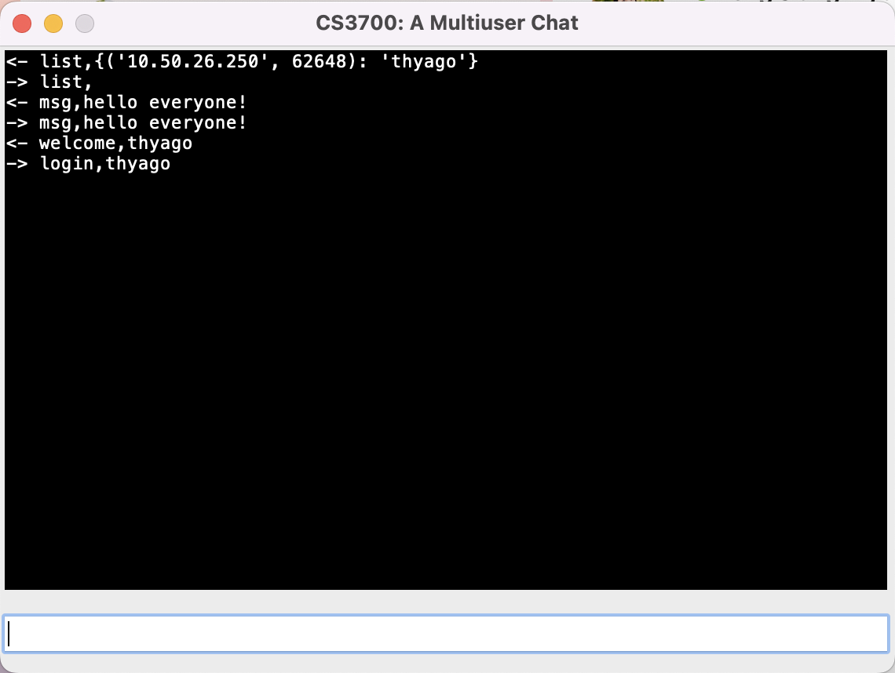

[](https://classroom.github.com/a/_KShvnrt)
# Overview

In this assignment you are asked to write a multiuser chat desktop application in Python using sockets. Users are uniquely identified by their login names. The client side of the application is multithreaded and must implement a GUI (Graphical User Interface). The communication between the client and the server follows a simple protocol described in the next section. 

The server works by sending messages to all clients using a multicast group address, while receiving messages from the clients through an unicast UDP socket bound to a known port. In reverse, clients send messages to the server using unicast, while receive messages from the server through the same multicast group address used by the server. In this multiuser chat application, all messages sent by the users are forward to ALL of the registered users (private messaging is not allowed).  

# Communication Protocol

In the following protocol description, \<user\> and \<msg\> are to be replaced by the user's login name and the message string, respectively.

## Client to Server

```
login,<user>
```

This message is used by the client to communicate the user's name to the server.  

```
msg,<msg> 
```

This message is used by the client to send a message to the server so it can be relayed to all active users in the chat.  

``` 
list, 
```

This message is used by the client to request the server to send a list of all active users in the chat. Note that the protocol requires that all messages have a comma. 

```
exit, 
```

This message is used by the client to notify the server that the user wants to leave the chat. Note that the protocol requires that all messages have a comma. 

## Server to Client

```
welcome,<user> 
```

This message is used by the server to notify all users that a new user entered the chat. This message is always sent as a result of a login message sent by one of the users.  

```
msg,<msg> 
```

This message is used by the server to relay a message sent by a client to all active users in the chat.  

```        
bye,<user> 
```

This message is used by the server to notify all users that a user left the chat. This message is always sent as a result of an exit message sent by one of the users.  

``` 
list,<user>,<user>,...,<user> 
```

This message is used by the server to send a list of all active users in the chat. This message is always sent as a result of a list message sent by one of the users. 

# GUI (Graphical User Interface)

You are required to implement a GUI for the client that resembles the one below. 



You can implement a different GUI but the application's functionality should remain the same. The client's GUI should have a way to differentiate between incoming and outgoing messages. We suggest prefixing all messages with '<-' and '->' to denote incoming and outgoing messages, respectively. The client's GUI should have a input text field where users can write their messages, according to the communication protocol. 

There is no need to implement a GUI for the server. However, the server should display the messages that arrive to it using a format similar to the one shown below. 

```
Multiuser server is ready on 0.0.0.0:4321!
2024-09-23 13:52:29.308048 login request has arrived from thyago@('10.50.26.250', 62648)
2024-09-23 13:52:42.131629 msg "hello everyone!" has arrived from user: thyago@('10.50.26.250', 62648)
2024-09-23 13:52:52.786807 list request has arrived from user: thyago@('10.50.26.250', 62648)
```

# Concurrent Programming 

The client needs to be multithreaded because it has to not only implement a GUI and but also, at the same time, react accordingly when a new message arrives from the server. The client's GUI must be implemented in the main thread. Also, because the client needs to update the GUI both when a message is sent and received, the potential for **race condition** needs to be addressed. 

# Testing 

The instructor should be able to run the submitted client with their own server. Conversely, the instructor should be able to run the submitted server with their own client. 

# Rubric

```
+10 the two server sockets were created and bound correctly (TODO #1)
+10 server 'login' type message was implemented correctly (TODO #2)
+10 server 'msg' type message was implemented correctly (TODO #2)
+10 server 'list' type message was implemented correctly (TODO #2)
+10 server 'exit' type message was implemented correctly (TODO #2)
+5 client's unicast UDP socket was created correctly (TODO #3)
+5 client's server address instance variable was initialized correctly (TODO #4)
+10 client's GUI was implemented in a way that matches the expected functionality (TODO #5)
+5 client allows users to send messages to the server (TODO #6)
+5 client allows users to display messages received by the server (TODO #7)
+5 client's mcast socket was created correctly (TODO #8)
+5 client's mcast socket was configured correctly (TODO #9)
+5 client's window instance variable was initialized correclty (TODO #10)
+5 thread's run code to read from the mcast socket and update the GUI was implemented correctly (TODO #11)
```